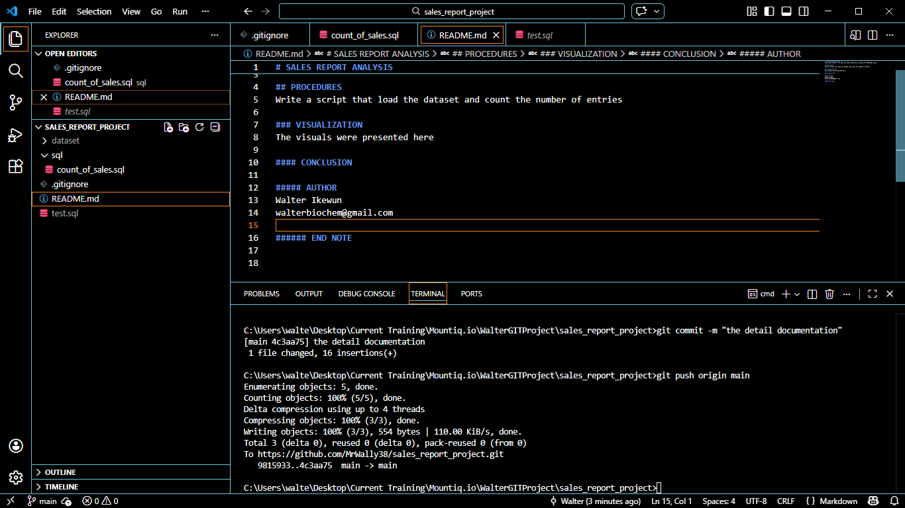

# SALES REPORT ANALYSIS
This sales report is to show the sales trend over a period of twenty(20) years.

## PROCEDURES
Write a script that load the dataset and count the number of entries

### VISUALIZATION
The visuals were presented here. 

#### CONCLUSION

##### AUTHOR
Walter Ikewun
walterbiochem@gmail.com

###### END NOTE

